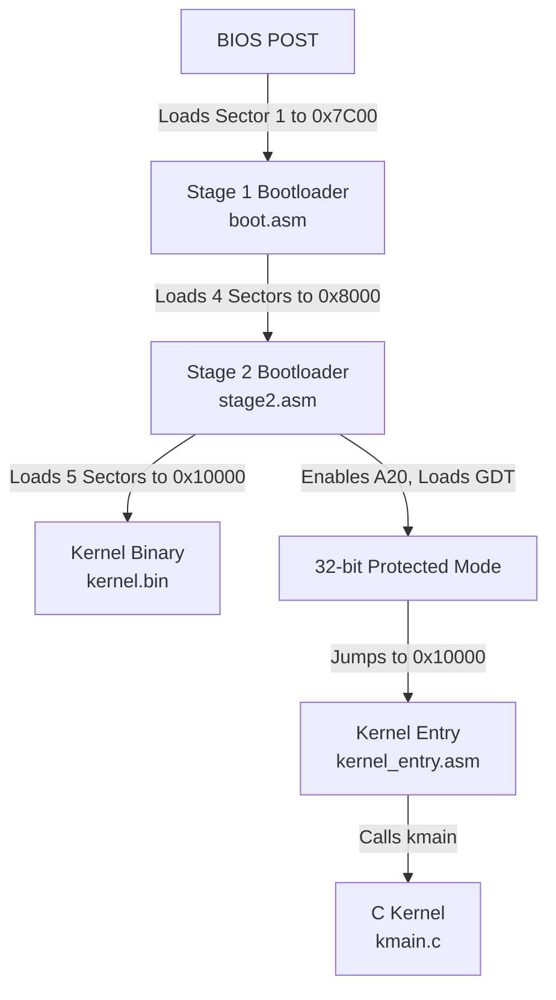

# OmegaOS Bootloader & Kernel

A custom 32-bit x86 Operating System entry point featuring a two-stage bootloader, 32-bit Protected Mode transition, A20 line enablement, and a basic C kernel.

---

## Architecture Overview



### Memory Map

| Address Range | Size / Details | Description |
| :--- | :--- | :--- |
| `0x7C00` | 512 Bytes | Stage 1 Boot Sector |
| `0x8000` - `0x8FFF` | 2 KB (4 sectors) | Stage 2 Bootloader |
| `0x10000` | Kernel Entry | Kernel Target Destination |
| `0x90000` | Stack Base | 32-bit Stack Pointer Destination |
| `0xB8000` | VGA Text Buffer | Video Memory (writes directly to screen) |

---

## Detailed Execution Flow

### 1. Stage 1 Bootloader (`src/bootloader/boot.asm`)
Loaded by the BIOS at physical address `0x7C00` in 16-bit Real Mode.
- Saves the BIOS boot drive number from the `DL` register.
- Sets up a temporary stack pointing to `0x7C00`.
- Uses BIOS Interrupt `0x13, AH=0x02` to load **4 sectors** starting from Sector 2 (LBA 1) into memory offset `0x8000` (Stage 2).
- Prints `"Stage1 OK"` via teletype output (`INT 0x10, AH=0x0E`).
- Execution jumps directly to Stage 2 (`jmp 0x8000`).

### 2. Stage 2 Bootloader (`src/bootloader/stage2.asm`)
Executes at `0x8000` in 16-bit Real Mode.
- Loads **5 sectors** from disk (starting at Sector 6) to segment `0x1000:0x0000` (physical address `0x10000`), which is the destination for the linked C kernel.
- Enables the **A20 Address Line** using the Fast Gate Port `0x92`.
- Disables interrupts (`cli`) and loads the **Global Descriptor Table (GDT)** descriptor mapping out:
  - Null descriptor
  - Code segment descriptor (flat 4GB, privilege 0, 32-bit default)
  - Data segment descriptor (flat 4GB, privilege 0, writable)
- Switches the CPU to 32-bit Protected Mode by setting the PE (Protection Enable) bit in `CR0`.
- Performs a far jump to flush the pipeline and transition execution into 32-bit instructions.
- Initializes all data segment registers to the new Data Segment selector.
- Configures the 32-bit stack pointer at `0x90000`.
- Writes the letter `'P'` in white-on-black directly to the VGA video memory at `0xB8000`.
- Invokes the C kernel entry point at physical address `0x10000`.

### 3. Kernel Entry & Main (`src/kernel/`)
- **`kernel_entry.asm`**: A thin assembly wrapper linked at the very beginning of the kernel binary. It calls the external C function `kmain` and handles CPU halts if it returns.
- **`kmain.c`**: Written in C. It directly writes the string `"Hello c kernel"` to the text-mode VGA frame buffer starting at `0xB8000` with white-on-black formatting, and enters an infinite halt loop.

---

## File Structure

- [src/bootloader/boot.asm](file:///home/omega/omegaos/src/bootloader/boot.asm) - Stage 1 bootloader (512 bytes boot sector).
- [src/bootloader/stage2.asm](file:///home/omega/omegaos/src/bootloader/stage2.asm) - Stage 2 bootloader (handles GDT, A20, Protected Mode).
- [src/kernel/kernel_entry.asm](file:///home/omega/omegaos/src/kernel/kernel_entry.asm) - Entry point stub for the C kernel.
- [src/kernel/kmain.c](file:///home/omega/omegaos/src/kernel/kmain.c) - Main kernel logic in C.
- [Makefile](file:///home/omega/omegaos/Makefile) - Automated multi-stage build system.
- [linker.ld](file:///home/omega/omegaos/linker.ld) - Linker script mapping kernel memory origin to `0x10000`.

---

## Building and Running

### Prerequisites

You need an x86 cross-toolchain or a local Linux system with:
- **NASM** (Netwide Assembler)
- **GCC** (configured for 32-bit ELF output, e.g., `gcc-multilib` package)
- **LD** (GNU Linker)
- **QEMU** (i386 emulator)
- **Make**

### Commands

To compile the entire OS stack and output the raw floppy disk image:
```bash
make
```

Under the hood, this compiles the assembly files, compiles the C source code, links the kernel at `0x10000` using `linker.ld`, and outputs:
- `build/boot.bin` (512 B - 1 sector)
- `build/stage2.bin` (2048 B - 4 sectors)
- `build/kernel.bin` (linked entry + kernel objects)

These are concatenated sequentially using `cat` and padded/truncated to a standard 1.44MB size (1440 KB) using `truncate -s 1440k` to assemble `build/main_floppy.img`. This ensures that all sectors loaded by the bootloader are present and readable from the virtual floppy disk.

#### Run in Emulator
To launch the compiled floppy image in QEMU:
```bash
make run
```

#### Debugging
To freeze the CPU at startup and wait for a GDB connection on port `1234`:
```bash
make debug
```

#### Clean Build Artifacts
```bash
make clean
```
